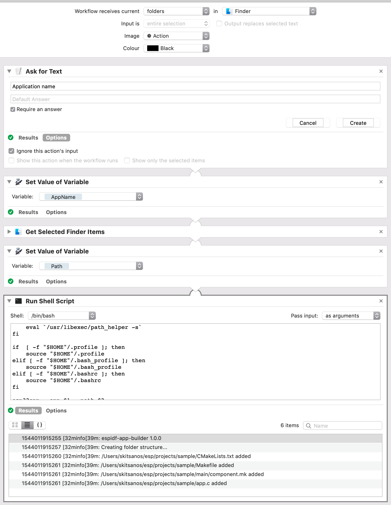

# espidf-app-builder
CLI utility for creating ESP-IDF apps


### Installation

Clone to your drive

```ssh
git clone https://github.com/skitsanos/espidf-app-builder.git
```

Install dependencies

```ssh
cd espidf-app-builder
npm install
```

Once dependencies installed, you need to link. The npm link command allow us to locally ‘symlink a package folder’, and for our needs, it will locally install any command listed in the bin field of our package.json. In other words, npm link is like a NodeJS package installation simulator. It is worth to mention that npm link has a wider usage that exceeds the scope of this guide

```ssh
sudo npm link
```

Now you can run it by typing _esp32app_. Add --help to learn on command line arguments required

```
esp32app --help
```

### Command line arguments
```
Usage: esp32app -name -path

Options:
  -v, --version                 output the version number
  -a, --app <application name>  application name
  -p, --path <path>             path where application will be created
  -h, --help                    output usage information
```

Will create a directory structure and minimal set of files required for ESP-IDF appplication:

```
├─ /components
├─ /main
├─── app.c
├─── component.mk
├─ CMakeLists.txt
├─ Makefile

```

After application structure created, don't forget to run config

```
make menuconfig
```

### Setting OSX Finder Quick Action with Automator



```sh
if [ -x /usr/libexec/path_helper ]; then
    eval `/usr/libexec/path_helper -s`
fi

if  [ -f "$HOME"/.profile ]; then
    source "$HOME"/.profile
elif [ -f "$HOME"/.bash_profile ]; then
    source "$HOME"/.bash_profile
elif [ -f "$HOME"/.bashrc ]; then
    source "$HOME"/.bashrc
fi

esp32app --app $1 --path $2
```
